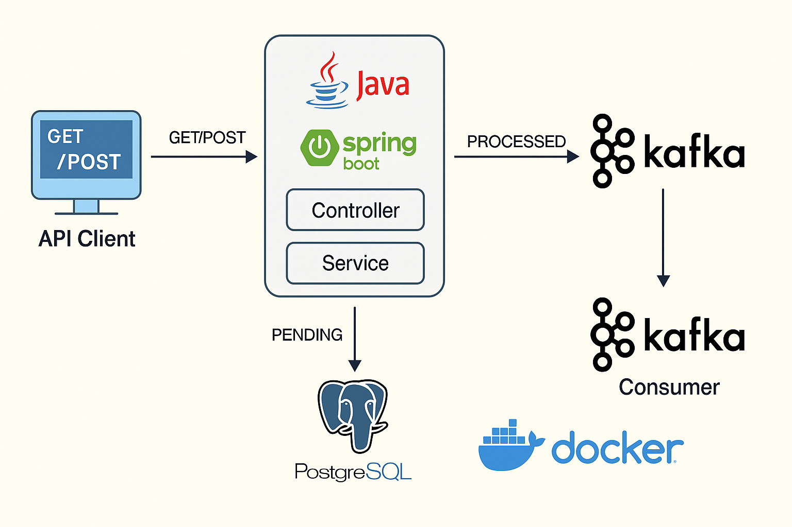

# 💳 PayAPI – Desafio Técnico PicPay

Projeto desenvolvido como parte de um estudo técnico com foco em backend Java, arquitetura de microsserviços e mensageria com Kafka.

---

## 🖼️ Arquitetura da Solução


---

## 📦 Stack utilizada

- Java 21
- Spring Boot 3
- Spring Data JPA
- PostgreSQL (via Docker)
- Apache Kafka (via Docker)
- Lombok
- Swagger / OpenAPI
- Docker Compose

---

## 📂 Estrutura do Projeto

```
src/
├── main/
│   ├── java/com.julien.payapi/
│   │   ├── controller/        # REST Controllers
│   │   ├── dto/               # Data Transfer Objects
│   │   ├── entity/            # JPA Entities e Enums
│   │   ├── kafka/             # Kafka Producer e Consumer
│   │   ├── repository/        # Interfaces JPA
│   │   ├── service/           # Regras de negócio
│   │   └── PayApiApplication  # Classe principal
│   └── resources/
│       ├── application.yml              # Configuração base
│       ├── application-dev.yml         # Ambiente de desenvolvimento
│       └── application-prod.yml        # Ambiente de produção
```

---

## ⚙️ Funcionalidades

- Criar pagamentos via REST
- Persistir dados em banco PostgreSQL
- Produzir eventos para Kafka ao criar pagamentos
- Consumir eventos de Kafka e atualizar status
- Documentação automática com Swagger

---

## 🔁 Fluxo principal

1. Cliente faz `POST /payments` com descrição e valor
2. API salva o pagamento com status `PENDING`
3. Evento é enviado ao Kafka
4. Consumer ouve o evento e atualiza o status para `PROCESSED`

---

## ▶️ Como rodar localmente

### Pré-requisitos
- Docker e Docker Compose
- JDK 21
- Maven

### Subir infraestrutura (PostgreSQL, Kafka, Zookeeper):

```bash
docker compose up -d
```

### Rodar a aplicação com perfil de desenvolvimento:

```bash
mvn spring-boot:run -Dspring-boot.run.profiles=dev
```

---

## 📮 Exemplos de requisição

### Criar pagamento

`POST /payments`

```json
{
  "description": "Assinatura Premium",
  "amount": 49.90
}
```

### Buscar pagamento

`GET /payments/1`

---

## 📑 Swagger

Disponível em:

```
http://localhost:8080/swagger-ui.html
```

---

## ✅ Testes Automatizados

- `PaymentServiceTest`: cobre criação, busca e exceção
- (em progresso) `PaymentControllerTest`, `KafkaConsumerTest`

---

## ✍️ Autor

Julien Crouzillard  
Projeto técnico individual – backend focado em microsserviços e mensageria
