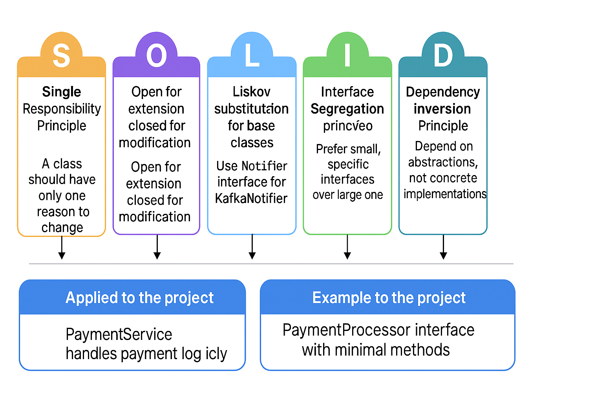
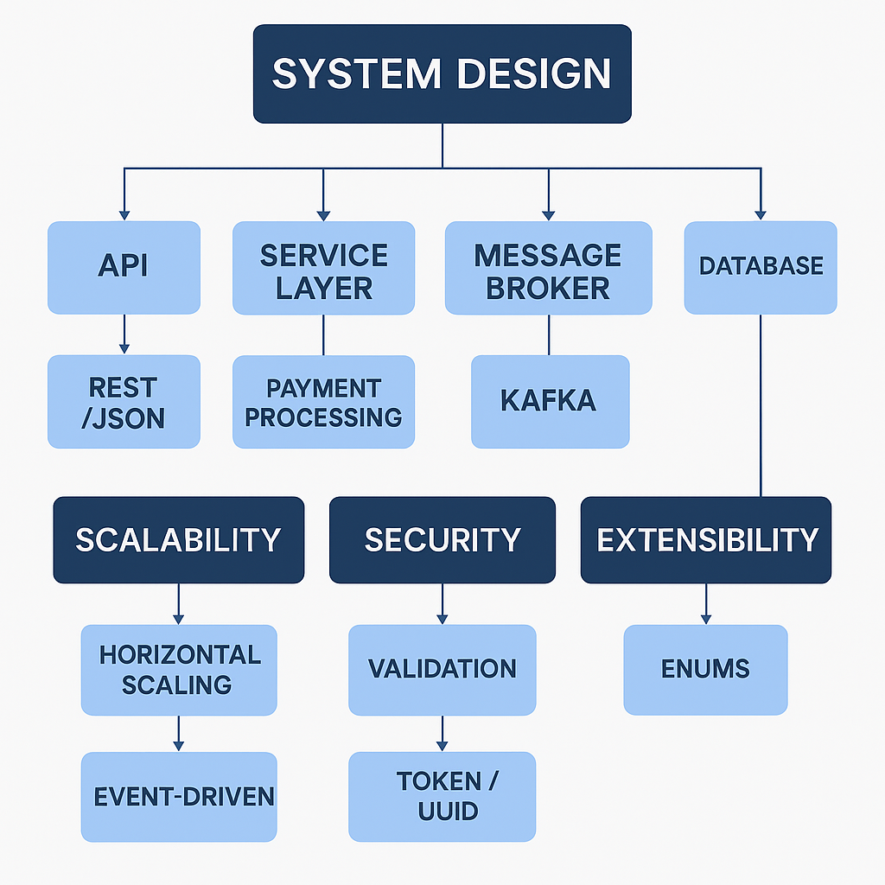

# 💳 PayAPI – Desafio Técnico PicPay

Projeto desenvolvido como parte de um estudo técnico com foco em backend Java, arquitetura de microsserviços e mensageria com Kafka.

---

## 🖼️ Arquitetura da Solução


---

## 📦 Stack utilizada

- Java 21
- Spring Boot 3
- Spring Data JPA
- PostgreSQL (via Docker)
- Apache Kafka (via Docker)
- Lombok
- Swagger / OpenAPI
- Docker Compose

---

## 📂 Estrutura do Projeto

```
src/
├── main/
│   ├── java/com.julien.payapi/
│   │   ├── config/            # Application Config
│   │   ├── controller/        # REST Controllers
│   │   ├── dto/               # Data Transfer Objects
│   │   ├── entity/            # JPA Entities e Enums
│   │   ├── kafka/             # Kafka Producer e Consumer
│   │   ├── repository/        # Interfaces JPA
│   │   ├── service/           # Regras de negócio
│   │   └── PayApiApplication  # Classe principal
│   └── resources/
│       ├── application.yml             # Configuração base
│       ├── application-dev.yml         # Ambiente de desenvolvimento
│       └── application-prod.yml        # Ambiente de produção
```

---

## ⚙️ Funcionalidades

- Criar pagamentos via REST
- Persistir dados em banco PostgreSQL
- Produzir eventos para Kafka ao criar pagamentos
- Consumir eventos de Kafka e atualizar status
- Documentação automática com Swagger

---

## 🔁 Fluxo principal

1. Cliente faz `POST /payments` com descrição e valor
2. API salva o pagamento com status `PENDING`
3. Evento é enviado ao Kafka
4. Consumer ouve o evento e atualiza o status para `PROCESSED`

---

## ▶️ Como rodar localmente

### Pré-requisitos
- Docker e Docker Compose
- JDK 21
- Maven

### Subir infraestrutura (PostgreSQL, Kafka, Zookeeper):

```bash
docker compose up -d
```

### Rodar a aplicação com perfil de desenvolvimento:

```bash
mvn spring-boot:run -Dspring-boot.run.profiles=dev
```

---

## 📮 Exemplos de requisição

### Criar pagamento

`POST /payments`

```json
{
  "description": "Assinatura Premium",
  "amount": 49.90
}
```

### Buscar pagamento

`GET /payments/1`

---

## 📑 Swagger

Disponível em:

```
http://localhost:8080/swagger-ui.html
```

---

## ✅ Testes Automatizados

- `PaymentServiceTest`: cobre criação, busca e exceção
- (em progresso) `PaymentControllerTest`, `KafkaConsumerTest`

---

## 🏗️ Princípios SOLID aplicados ao projeto

Este projeto foi construído com base nos princípios SOLID, garantindo um código mais limpo, extensível e fácil de manter.



### ✔️ Aplicações no projeto:

- **SRP (Single Responsibility)**: Cada classe tem uma função clara (controller, service, entity, etc).
- **OCP (Open/Closed)**: Fácil adicionar novos tipos de pagamento sem alterar a lógica central.
- **LSP (Liskov Substitution)**: Interfaces podem ser substituídas por suas implementações livremente.
- **ISP (Interface Segregation)**: Interfaces simples e diretas para cada responsabilidade.
- **DIP (Dependency Inversion)**: Uso de abstrações para facilitar testes e desacoplamento.

---

## 🧠 System Design Overview

Este projeto foi idealizado com foco em escalabilidade, performance e boas práticas de arquitetura de sistemas distribuídos. A imagem abaixo ilustra os principais componentes envolvidos:



### 🔍 Componentes principais:

- **API REST (Spring Boot):** expõe os endpoints para criação de pagamentos
- **Kafka:** comunicação assíncrona e desacoplada entre produtores e consumidores
- **PostgreSQL:** banco de dados relacional para persistência
- **Docker Compose:** orquestração dos serviços localmente
- **Validação e Segurança:** uso de tokens e validação com Jakarta Bean Validation
- **Extensibilidade:** suporte a múltiplos tipos de pagamento

---

## 🛠️ Retry e Redirecionamento de Mensagens no Kafka

A aplicação implementa um mecanismo de retry com Spring Kafka para garantir maior resiliência no processamento de mensagens.

- Em caso de falhas no consumo, o sistema realiza até 3 tentativas com um intervalo fixo de 3 segundos entre elas.
- Se todas as tentativas falharem, a mensagem é redirecionada automaticamente para um tópico de retry chamado `payment-retry-topic`.
- Essa abordagem evita perda de mensagens importantes e permite um reprocessamento assíncrono futuro.
- Os tópicos são criados automaticamente no bootstrap da aplicação.

Além disso, a aplicação conta com regras específicas de negócio, como:

- Validação que impede a criação de pagamentos PIX com valores superiores a R$1000.
- Validação automática dos atributos via Bean Validation (`@Valid`) no controller.

Esses mecanismos fortalecem a confiabilidade e controle da aplicação em ambientes distribuídos.

---
## ✍️ Autor

- Julien Crouzillard
- Projeto técnico individual – backend focado em microsserviços e mensageria
---
